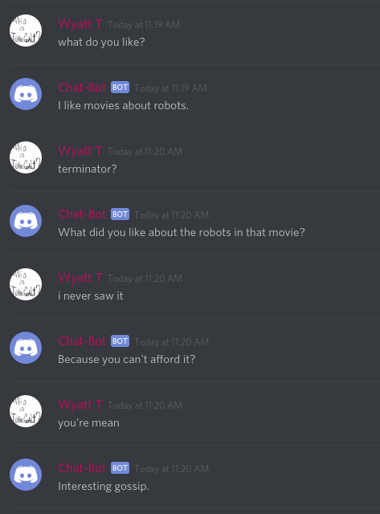

# Discord AI Chat Bot

This is a simple C# discord bot which uses an AIML bot to
chat with people in a channel. To prevent this from taking over my server I limit this bot to talking on the #therapy channel.

## How to Run

1) First you have to register a app on the discord [developer](https://discordapp.com/developers/docs/intro) site. After that you 
need to get the token and put it in the Program.cs file.

2) Next, you need to load this project into visual studio and install all the required nuget packages. (VS might do this automatically for you with the packages.config file)

3) Download [AIMLBOT](https://sourceforge.net/projects/aimlbot/) and copy all the files in the bin/debug folder into your own debug folder.

4) Edit the personality file in the AIMLBOT Settings.xml file. You can do fun things like change the name of preferences of the chat bot.

5) Cross your fingers and run the program. If things break... discord might have updated their api again :(